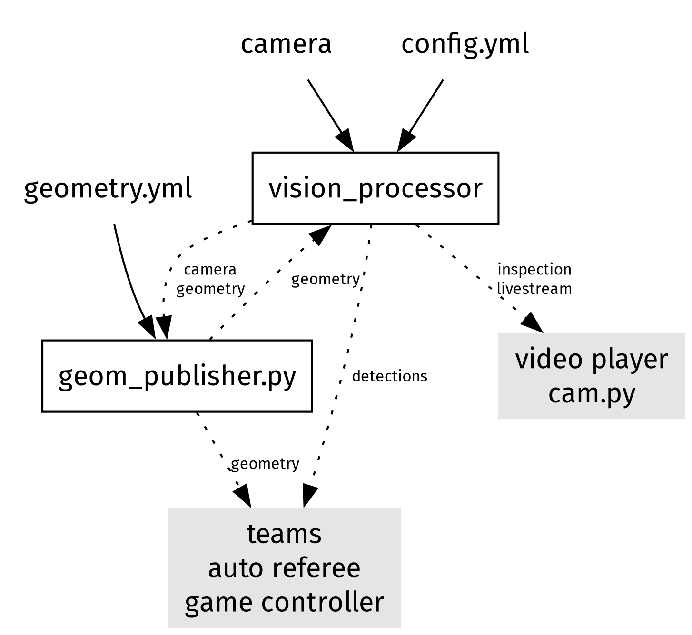
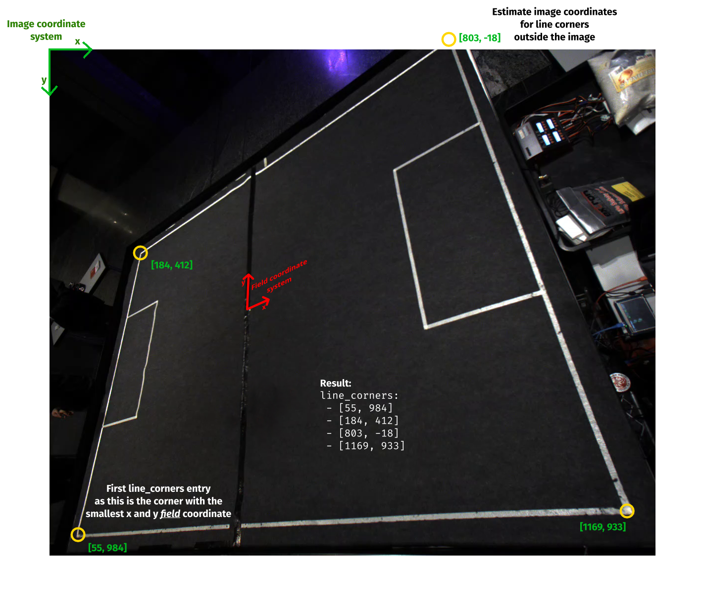

# Vision Processor
A replacement for the aging (ssl-vision)[https://github.com/RoboCup-SSL/ssl-vision].
The shape based blob detector and decentralized software architecture is intended to
minimize setup time and improve detection rates in uneven illumination conditions.
It currently supports Teledyne FLIR (Spinnaker), Matrix Vision (Bluefox3/mvIMPACT) and OpenCV camera backends.

The `vision_processor` is the image processing component that processes a camera feed
to multicast the detected robot and ball positions and a debug video livestream.
The geometry publisher `geom_publisher.py` publishes the field geometry
for all vision_processors, teams and the game controller.
`cam_viewer.py` opens the `mpv` video player with the camera streams from the vision_processor instances.

## Dependency installation and compilation

### geom_publisher.py cam_viewer.py
Required only for the geometry publisher and camera viewer.
`mpv` is optional and only required for the camera viewer.

Debian/Ubuntu based distributions: `apt install protobuf-compiler python3-protobuf python3-yaml mpv`

Arch based distributions: `pacman -S make python-protobuf python-yaml mpv`

Installation with PIP: `pip install protobuf pyyaml`

### vision_processor automatic

1. Install the camera SDK required for your camera type
   (Arch user repository mvIMPACT: `mvimpact-acquire` Spinnaker: `spinnaker-sdk`)
2. Debian/Ubuntu/Arch Linux/Manjaro: Run `./setup.sh`.
   If the script wants to install an OpenCL driver for the wrong GPU (e.g. integrated graphics card)
   or you want, need or have a different OpenCL driver skip the driver installation with `SKIP_DRIVERS=1 ./setup.sh`.

### vision_processor manual

1. Install the camera SDK required for your camera type
   (Arch user repository mvIMPACT: `mvimpact-acquire` Spinnaker: `spinnaker-sdk`)
2. Install the required dependencies:

   - cmake
   - Eigen3
   - ffmpeg
   - gcc
   - OpenCL (GPU based runtime recommended)
   - OpenCV
   - protobuf
   - yaml-cpp

3. Compile vision_processor:

    cmake -B build .
    make -C build vision_processor

## Setup

1. Complete the dependency installation and compilation section.
2. Configure one `config-minimal.yml` or `config.yml` for each camera, skip the `geometry` section for now.
   The camera ids are assigned like in ssl-vision:
   
3. Start `build/vision_processor config[X].yml` for each camera.
4. Tune the orientation and position of each camera.
   You can view the camera feeds with `python/cam_viewer.py --cameras <X>`.
5. Restart the `vision_processor`s for the generation of a new sample image `img/sample.[X].png`
   and complete the `geometry` section of each camera config with it.
   Visual explanation how to determine `line_corners`: 
6. Restart all `vision_processor`s to reload the config.
7. Modify `geometry[X].yml` to match your field geometry.
   (for simple use cases configuring the field size, penalty area and goal will suffice)
8. Start `python/geom_publisher.py geometry[X].yml`.

## Troubleshooting

If no OpenCL platform can be found despite OpenCL driver installation, check the users groups and permission to compute
on the GPU (e.g. for Intel: ).

The video livestream cycles through 4 different views:
1. **Raw camera data**
   If the data is very bright, dark or miscolored consider adjusting
   the camera `gain`, `exposure` and `white_balance` in your `config[X].yml`.
2. **Reprojected color delta**
   If the visible reprojected image extent does not match the field boundary the geometry calibration has issues.
   If color blobs are desaturated in the center your image might be overexposed/too bright (`gain`, `exposure`).
3. **Gradient dot product**
   All color blobs should be visible here as black and white checkered rings.
4. **Blob circularity score**
   If the blob score of some undetected blobs is too faint consider reducing the `circularity` threshold.

If blobs are attributed the wrong color (or balls are seemingly undetected despite high blob scores)
adjust the reference colors under `color`.

If nothing helps:
Activate `stream: raw_feed: true` in your `config[X].yml` and record the video livestream
with `ffmpeg -protocol_whitelist file,rtp,udp -i python/cam[X].sdp cam[X].mp4`.
Publish the resulting video including your `config[X].yml` and `geometry[X].yml` for further remote analysis.
