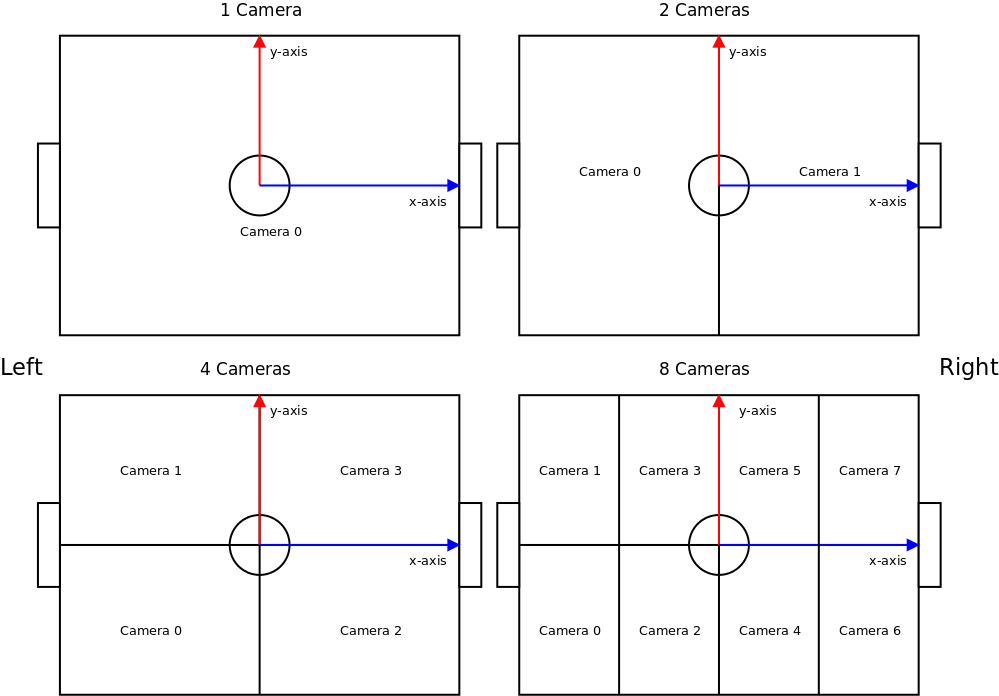
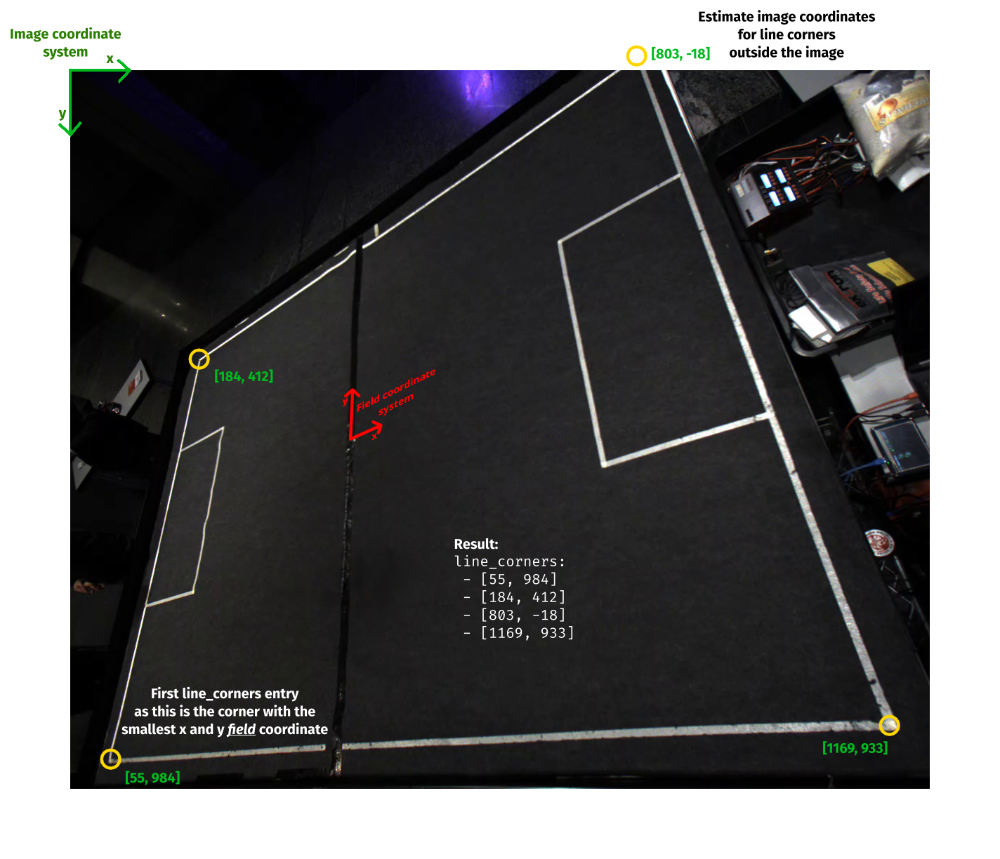

# VisionProcessor documentation

This is a short introduction to the algorithms, configuration and setup of VisionProcessor.
More details about the approaches and algorithms can be found in the corresponding [master thesis](https://download.tigers-mannheim.de/papers/2024-Vision-based-Understanding-of-the-RoboCup-Small-Size-League-field-Weinmann.pdf).
Additional descriptions to configuration options and default values can be found in the [config itself](config.yml).
Additional information for the setup can be found in the [README](README.md).

## Camera

Prior to any digital processing, physical light needs to be converted to an analogue voltage, which needs to be converted to a digital value.
The `exposure` controls the time duration over which light is allowed to charge the camera sensor.
A longer duration brightens the image and reduces noise, but can lead to reduced camera frame rate if the exposure time approaches the frame time and increases [motion blur](https://en.wikipedia.org/wiki/Motion_blur_(media)) due to increased object motion.
Fast moving balls are especially sensitive to this motion blur, which is why an exposure longer than 8 ms is not recommended, better are 6 ms. 

The `gain` is the linear analoge amplification of the camera sensor charge during signal digitalization.
A higher gain factor brightens the image, but results in higher noise levels.
As the comparatively bright blobs only take up a small fraction of the total image, automatic camera gain and exposure adaption algorithms frequently lead to overexposure (image too bright), leading to white blobs, causing unstable color classification.

Color sensing inside cameras is typically done with a Bayer matrix, which are alternating color filters in front of the sensor cells.
The `white_balance` is the amplification factor of `blue` and `red` colored camera sensor cells relative to the `green` cells.
Automatic camera white balance algorithms might have problems with a large part of the image being a uniform green carpet, which can cause all colors to be significantly shifted on the [UV color plane](https://upload.wikimedia.org/wikipedia/commons/f/f9/YUV_UV_plane.svg).
This can cause color misclassification when the `reference_force` pulls the learned colors back to the idealized reference color.

`gamma` is a digital exponential amplification factor ${out} = {in}^{gamma}$.
A gamma value smaller than 1 evens out the contrast over a wider brightness spectrum.
This can result in a loss of color contrast, resulting in problems with color differentiation in extreme cases.
In case of spotty detection performance in darker areas on an unevenly illuminated field therefore try a gamma value of 0.7 - 0.8.

Different camera manufacturers have different APIs to connect and control cameras.
Therefore different `driver`s are supported in vision processor:

- `SPINNAKER` for FLIR cameras
- `MVIMPACT` for Bluefox3 cameras
- `OPENCV` for generic cameras (e.g. video4linux cameras, webcams) and image and video files (for such prerecorded data no camera parameter adjustment is possible)

## Geometry

Field shape and size are important informations for every participant in the field network.
For some applications field lines, [ball model](https://ssl.robocup.org/wp-content/uploads/2026/04/2026_ETDP_TIGERs-Mannheim.pdf) and camera model information is required as well.
This information is broadcasted with the vision protocol in so called geometry packets.
In VisionProcessor the `python/geom_publisher.py` script uses a geometry.yml file to publish this information.
For setup ideally start by copying one of `geometry-divA.yml` or `geometry-divB.yml` to `geometry.yml` (the name the systemd service expects) and modify as necessary.

## Camera model calibration

A camera model mapping image pixels to the physical field is necessary to be able to detect object positions in the physical world.
As most of the parameters of the camera model are difficult to determine manually automatic calibration procedures are used.

An unique `cam_id` is necessary for identifying each camera and therefore VisionProcessor instance on a field.
As the camera might only see a fraction of the field the `camera_amount` indicates the visible fraction.
The interaction of `cam_id` and `camera_amount` on multi camera setups is visualized in .

The `camera_height` has to be provided when the camera looks vertically down, as in this case multiple parameters collapse due to all field lines and therefore camera calibration features are on a plane with a constant distance to the camera.
Depending on field line strength and surrounding clutter it can be tricky to discover the correct lines as field lines.
Therefore the four outer field line corners of the expected visible field fraction have to be provided manually as `line_corners`: .
For determining the pixel positions the [GIMP](https://www.gimp.org/) program can be used.

VisionProcessor will start with the calibration as soon as a geometry packet has been received and the necessary parameters (`line_corners`, if necessary `camera_height`, on multi camera fields `cam_id` and `camera_amount`) have been provided.

For calibrating intrinsic parameters such as the distortion and the principal point a field line detection algorithm that assumes most visible lines should be straight is used.
First pixels belonging to a field line are classified by comparing each pixels brightness against surrounding pixels based on the `field_line_threshold`.
The field line width to determine the surrounding pixel distance is estimated based on the given geometry information.
OpenCV line segment detection is then used to get a set of straight line segments.
These are merged to potentially curved lines based on the `min_line_segment_length`, `max_line_segment_offset` and `max_line_segment_angle`.
The Levenberg-Marquardt algorithm is then used to find the best distortion and principal point parameters straightening the curved lines.

Based on the given `line_corners` the camera position, orientation and focal length is calibrated as a Perspective-n-Point problem with Levenberg-Marquardt optimization.
To match the corner based calibration to the detected field lines an optional further `refinement` calibration is available.
This approach attempts to minimize the distance between the model of the field lines from the geometry information and the nearest detected field line pixel.

Check how well the calibration matches the physical field by inspecting `img/*pixels.refined.png`.
The camera calibration can produce bad results due to misdetections in the field line based intrinsic calibration (check `img/*lines.png` for errorneous results) and the refinement step (compare `img/*pixels.corner.png` and `img/*pixels.refined.png`) or misconfiguration in the corner based calibration (check if corner positions match in `img/*pixels.corner.png`).
In the case of a bad result you can try to restart both geom_publisher.py and VisionProcessor a few times to exclude a spurious misdetection.
Try disabling `refinement` in case of repeated bad results and remove curved clutter from the field if possible.
If the results remain unsatisfactory, load the produced reference image `img/*geomcalib_input.png` in SSL-Vision and attempt a manual calibration there.

## Blob detection

To detect the color blobs on top of the robot multiple stages of processing happen on the GPU.
The image is converted into a differential color space that attempts to minimize the impact of brightness changes.
The image is reprojected, flatting the field, to make the size and shape of the color blobs uniform independent of physical location.
The reprojected differential color view is one of the debug views available in the livestream.

If the field does not fit the reprojected view something has gone wrong during camera model calibration.
Keep in mind that the reprojection happens at maximum robot height, therefore field lines might be slightly offset. 

The dot product of gradients is generated with neighboring pixels in x and y direction for shape detection.
This is the second reprojected debug view available.
Depending on the direction of the gradient the values should be negative/black (+x-y or -x+y) or positive/white (+x+y or -x-y).
A faint or missing gradient around a blob could be the root cause behind a missing blob detection.

The blob score is generated by averaging the four quadrants around each pixel and taking the minimum (inverted) gradient dot product value of these four quadrants.
The blob score is the last reprojected debug view available.
Blobs should be visible here as bright points.
Points that are local maxima and exceed the `circularity` threshold are treated as detected blobs.

## Object detection

A bot detection is generated if a set of 5 blobs corresponds to the expected butterfly pattern positions.
If a bot has been seen previously and 2 or more blob positions match the expected trajectory (with added tolerances `min_tracking_radius` and `max_bot_acceleration`) a bot detection is generated as well.
The team is assigned based on the central blob being closer to `yellow` or `blue`, the bot id based on the side blobs being closer to `green` or `pink`.

A ball detection is generated for each blob that is not within a bot detection, closer to `orange` then to the `field` color, has a ratio of blob score to color standard deviation bigger than `score` and is at least `min_cam_edge_distance` away from the image border when inside the field.

A confidence is computed for each detected object based on various expectations and deviations thereof, for details inspect `src/blobs/hypothesis.cpp`.
Objects with a confidence below `min_confidence` are filtered out.

The colors used for classification are updated based on three factors.
The reference colors provided in the config with a factor of `reference_force`,
the previously used color with a factor of `history_force` and
the average color of all blobs assigned to that color with a factor of `1 - reference_force - history_force`.
To facilitate bootstrapping and recovery from misclassifications, a k-means clustering algorithm with 2 clusters is used.
In case of indicators pointing at only one cluster being present no color update is done for the corresponding color pair.
As bots are likely to have both `green` and `pink` blobs present the k-means clustering is done on a per bot level instead of globally.

As `pink` and `orange` are quite similar for a camera, a `pink` blob is likely to be misdetected as a ball in case a bot was not detected.
If it happens at an image border inside the field, adjust `min_cam_edge_distance` accordingly.
If it happens during robot collisions, adjust `clipping_tolerance`.

If bots are assigned to the wrong team or even toggling, check that the blobs are not white due to overexposure (too high `exposure` and `gain`).
Misclassification of bots, erroneous ball detections at field lines and missing ball detections can be a symptom of a (significantly) off-center `white_balance`.
This is the case if white objects appear colored in the raw camera output.

## Network output

VisionProcessor listens on game controller messages at `gc_ip` and `gc_port` for automatic team height assignments.
Detections are sent to `vision_ip` and `vision_port`, while geometry messages and detections from other cameras are expected from there.
The RTP video debug stream is sent on different ip addresses depending on `cam_id`, `ip_base_prefix` and `ip_base_end` and `stream.port` to prevent sending the video stream to unintended receivers.
